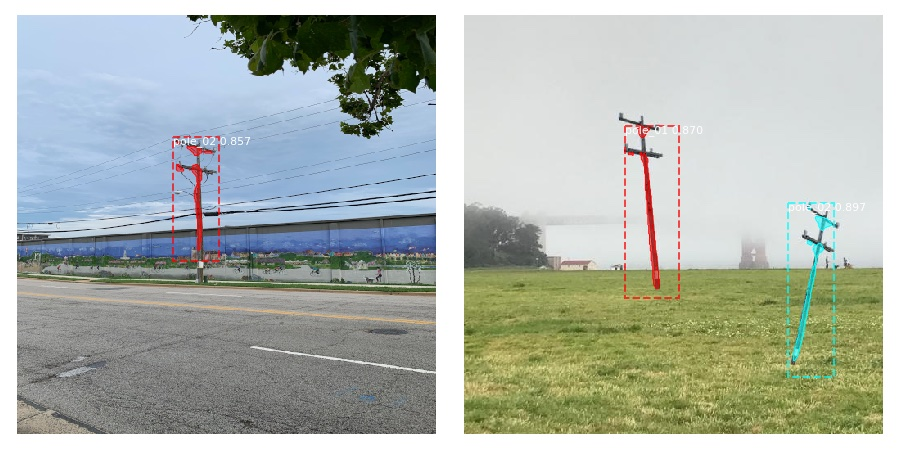

# NRECA - Pole Detection and Classification

NRECA Pole detection and Classification project initial stage

Author: Zhe(James) Zhou (Data Science Intern at NRECA)

Supervisor: David Pinney (Analytics Program Manager at NRECA)


## Introduction

NRECA have some eletrical cooperatives who use drones to help them do electrical pole asset management. The way they do it is to have a person fly the drone, and have another person look at the video to perform asset management. This is quite time consuming in my oppinion. Nowadays, with the fast develop of computer vision technology and algorithms, we can automate this human-eye based identification process.

Since we do not have sufficent amount of image data for training the Mask-R-CNN, I decided to create a synthetic dataset just to get some inital results to see if this architecture is possible.

The dataset creation and identification network worked well. Below is an example image from the test set showing successful pole identification. For the full results, please see the train and test [Jupyter notebook](https://github.com/dpinney/droneEnergyImageAnalytics/blob/master/train_mask_rcnn.ipynb). 



## Part 1 - Synthetic Image Generation

Since we do not have any real data available yet, I decided to make a synthetic image dataset.

The json file that stores patterns' segmention area info and boxing info follow the [coco-dataset](http://cocodataset.org/#explore) format

### Prerequisites

1. This program need python 3 and following packages:

	```
	json
	random
	numpy
	pathlib
	tqdm
	pillow
	scikit-image
	shapely
	```

2. Pictures:
	* Sample Background Image
	
		
		
		
	
	Make sure you have your foreground and background picture ready with following requirements:

	*	RGB format
	*	Exif, XMP, IPTC data have to be removed
	* 	Expected image directory structure:
 
		 ```
		 input_image_dir
		        + foregrounds_dir
		            + super_category_dir
		                + category_dir
		                        foreground_image.png
		        + backgrounds_dir
		                back_image.png
		 ```


### Running the program

1. Run `image_composition.py` to create synthetic datasets, `dataset_info.json` and `mask_definitioins.json`

	Here is an bash example of creating 20 images on my machine: 

	```
	python ./python/image_composition.py --input_dir ./datasets/input --output_dir ./datasets/output --	count 20 --width 512 --height 512
	```

2. Run `coco_json_utils.py` to create `coco_instances.json` from  `dataset_info.json` and `mask_definitioins.json`.

	Bash Eample:

	```
	python ./python/coco_json_utils.py -md ./datasets/output/mask_definitions.json -di ./datasets/output/	dataset_info.json
	```

</br>

## Part 2 - Train and test Mask-R-CNN

### Prerequisites - CUDA and Tensorflow setup

#### (You need to have a NVDIA GPU on your PC before going forward! )

**Windows**

1. Make sure your machine is running Python 3, better have Anaconda Python 3
2. [Download](https://developer.nvidia.com/cuda-10.0-download-archive) and install CUDA 10.0.
3. After CUDA installation, make sure there is `nvcc.exe` under `.../NVIDA GPU Computing Toolkit/CUDA/v10.0/bin/`,  and `cputi64_100.dll` under `.../CUDA/V10.0/extras/CUPTI/libx64`.
4. Download `cuDNN v7.5.0 (Feb 21, 2019), for CUDA 10.0` zip file. [Download Link](https://developer.nvidia.com/rdp/form/cudnn-download-survey) (registration required)
5. Unzip the file you just downloaded, open it and you should see a `cuda` folder. Rename this `cuda` to `cudnn`, and copy this `cudnn` folder under `.../CUDA/v10.0/`.
6. Add the path of `.../CUDA/V10.0/extras/CUPTI/libx64` to Path in Environment Variable.
7. Add the path of `.../CUDA/V10.0/cudnn/bin` to Path in Environment Variable.
8. Move the above two Paths up, so the top four Paths in your Environment Varialbe look like this:

	```
	.../CUDA/V10.0/bin
	.../CUDA/V10.0/libnvvp
	.../CUDA/V10.0/cudnn/bin
	.../CUDA/V10.0/extras/CUPTI/libx64
	```

9. Install tensorflow `pip install tensorflow-gpu = 1.13.1`
	
	**Note:**
	* Tensorflow 1.13 is recommended, since it works perfectly on my machine.
	* If you have the latest Tensorflow 2.0Beta installed, Tensorflow2.0 has a tool `tf_upgrade_v2` to to help transition legacy code to the new API. [See details](https://www.tensorflow.org/beta/guide/upgrade)
	* If you have trouble with `tf_upgrade_v2`, the following Python code can also do the trick for you:
		
		```python
		import tensorflow.compat.v1 as tf
		tf.disable_v2_behavior()
		
		```
		
		This makes possible to run 1.X code, unmodified (except for contrib), in TensorFlow 2.0
	

10. Try the following code in your Python console:
	
	```python
	import tensorflow as tf
	tf.test.is_gpu_available()
	
	```
	If it returens TRUE, then you have your Tensorflow and CUDA set up.

**Linux**

1. Make sure your machine is running Python 3, better have Anaconda Python 3
2. [Download](https://developer.nvidia.com/cuda-10.0-download-archive) CUDA 10.0 for linux (.deb file).
3. Follow the following commands to install CUDA:
	
	```
	sudo dpkg -i your_file_name.deb
	sudo apt-key add /var/cuda-repo-<version>/7fa2af80.pub
	sudo apt-get update
	sudo apt-get upgrade
	sudo apt-get install cuda
	
	```
4. Reboot your system and try `nvdia-smi` command in terminal, you should see your graphic card configurations.
5.  open your `~/bashrc` and add following command to the bottom:
	
	```
	export PATH="/usr/local/cuda-10.0/bin:$PATH"
	```
6. Download `cuDNN v7.5.0 (Feb 21, 2019), for CUDA 10.0` .tgz file. [Download Link](https://developer.nvidia.com/rdp/form/cudnn-download-survey) (registration required)
7. Unzip the file you just downloaded, open it and you should see a `cuda` folder. Rename this `cuda` to `cudnn`, and copy this `cudnn` folder under your prefered directory.
8. open your `~/bashrc` and add following command to the bottom, right under the one you added in step 4:
	
	```
	export LD_LIBRARY_PATH="...your_directory_path.../cudnn/lib64:$LD_LIBRARY_PATH"
	```

9. Install tensorflow `pip install tensorflow-gpu = 1.13.1`

10. Try the following code in your Python console:
	
	```python
	import tensorflow as tf
	tf.test.is_gpu_available()
	
	```
	If it returens **TRUE**, then you have your Tensorflow and CUDA set up.


### Prerequisites - Other Packages needed

I recomend you open up a new Python Environment via `conda create -n yourenvname python=3.6` to install the following packages in case you mess up your base environment. Python 3.6 is recomended, I had troubles with latest 3.7 for some reason.

```
numpy
scipy
Pillow
cython
matplotlib
scikit-image
keras
opencv-python
h5py
imgaug
```


### Once above requirments has been met, you can go ahead run the `train_mask_rcnn.ipynb`

</br>

## Video Inference
Now We have trained our Mask-R-CNN model and performed inference on image. The further step we  can take is to perform video inference. Thankfully, my buddy **Chengwei Zhang** wrote a tool to achieve this. Bellow is his repo and tutorial:

* [GitHub repo](https://github.com/Tony607/colab-mask-rcnn)
* [Tutorial](https://www.dlology.com/blog/how-to-run-object-detection-and-segmentation-on-video-fast-for-free/)

</br>

## Acknowledgments

* Sythetic Image Generation code thanks to **Adam Kelly** and **Junye Luo**. Beautifull code, easy to modify.
* Mask-R-CNN package (the `mrcnn` folder in repo), thanks to [Matterport](https://github.com/matterport/Mask_RCNN)
* Mask-R-CNN Video Inference, thanks to **Chengwei Zhang** [GitHub](https://github.com/Tony607)

